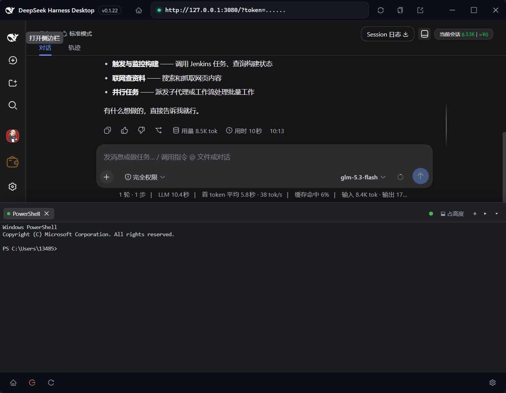

# dsh-single-terminal

<p align="center">
  
</p>

**dsh-single-terminal** 是 DeepSeek Harness（DSH）宿主的真实终端抽屉插件。它在
Web 应用底部挂一条交互式 PTY 终端（xterm.js）——可以正常敲命令、Ctrl-C、拖拽
改大小、开任意多个标签。

- **真 PTY，非模拟** —— 每个标签是一条真实伪终端（Windows 为 ConPTY，POSIX 为
  forkpty），由 `node-pty` 驱动；交互式 REPL、全屏程序、Ctrl-C 与原生终端一致
- **Shell 选择** —— Windows：PowerShell（默认）/ pwsh 7 / CMD / Git Bash / WSL
  （未安装的自动隐藏）+ config 自定义 shell；POSIX：`$SHELL` / bash / zsh / fish
- **两种抽屉模式** —— *占高度* 把页面内容顶起（无遮挡），*浮层* 悬浮于内容之上；
  顶边可拖拽调高度，模式与高度自动记忆。浮层为磨砂玻璃层（半透明背景 +
  `backdrop-filter` 高斯模糊），占高度为不透明。开合带滑入滑出动画
  （沿用宿主缓动曲线，尊重系统减动效设置）。
- **主题跟随** —— 抽屉与终端配色实时跟随宿主主题（浅色 / 深色 / 自定义主题），
  无需单独配置。
- **会话保活** —— 终端在页面刷新、抽屉开合后继续存活；重连后从环形缓冲回放
  近期输出。打开抽屉时若还没有任何终端，会自动用默认 shell 新建一个。
- **工作区路径感知** —— 当前会话归属某个工作区时，新建终端（含自动新建）直接
  落在该工作区根目录，无需手动 `cd`；无会话 / 无工作区时回退 `defaultCwd` 规则。
- **双语 UI** —— 跟随宿主界面语言（中文 / English）；`Alt+C` 开关抽屉

[English](README.md)

## 预览

终端抽屉截图（暗色主题跟随、浮层磨砂模式）：见 [preview.md](preview.md)。

## 功能

- **会话头部入口**（`conversation.session.header.utilities`）：会话头部
  utilities 区的「底部面板」(panel-bottom) 图标按钮，点击开合抽屉；悬停显示
  宿主 `Tooltip`
  气泡（含快捷键提示）。`Alt+C` 全局开合抽屉；焦点在终端输入区内时放行
  （`Alt+C` 作为 `ESC c` 发给 shell）。
- **抽屉**（`shell.overlay`）：frame 级底部抽屉，包含
  - 标签条 —— 每标签一条独立 PTY 会话，可独立选择 shell；每标签有关闭按钮
    （终止整棵进程树，已实测 pid 消失）；
  - `＋` 按钮（默认 shell 新建标签）与 `▸` 菜单（列出本机探测到的全部 shell，
    不可用的不显示）；
  - 模式切换（占高度 / 浮层）、连接状态点、收起按钮；
  - 顶边拖拽条（pointer capture 拖拽，最小 140px）。
- **占高度模式** 通过对框架根元素设 `padding-bottom` 把内容顶起（宿主没有底部
  停靠钩子）；找不到锚点元素时静默降级为浮层。
- **模型工具**：无——本插件刻意只做 UI。

## 配置

Schemastery `Config`（宿主 Plugins 设置页自动渲染），和 / 或 profile 的
`cordis.patch.yml`：

```yaml
- insert:
    - id: dsh-single-terminal
      name: dsh-single-terminal
      config:
        defaultShell: powershell   # powershell | pwsh | cmd | gitbash | wsl | <自定义 id>
        defaultCwd: home           # home | workspace | 绝对路径
        scrollbackLimit: 200000    # 每会话回放环形缓冲字节上限
        fontSize: 13
        fontFamily: Consolas, "Cascadia Mono", "Courier New", monospace
        customShells:
          - id: nu
            name: Nushell
            command: nu            # 支持从 PATH 解析
            args: []
```

- `defaultShell` —— `＋` 按钮使用的 shell；不可用时自动回退（Windows 回退
  `powershell`，POSIX 回退 `$SHELL`/`bash`）。
- `defaultCwd` —— 无工作区上下文时的启动目录：`home`（默认）从用户主目录启动；
  `workspace` 预留（当前等同 home）；绝对路径必须存在。当前会话归属工作区时
  优先使用工作区根目录（见上）。
- `customShells` —— 额外启动器；`command` 可为绝对路径或从 `PATH` 解析的名称
  （Windows 上叠加 `PATHEXT`）。

## 安装

```sh
# 本地开发
dsh plugin --profile web add ./dsh-single-terminal

# 已发布：npm / tarball / GitHub
dsh plugin --profile web add dsh-single-terminal
dsh plugin --profile web add ./dsh-single-terminal-0.1.0.tgz
dsh plugin --profile web add github:you/dsh-single-terminal#<sha>

dsh --profile web                 # 启动（宿主半边需重启后生效）
```

> **node-pty** 是宿主半边的原生依赖（`dependencies`，构建时保持 external，
> 运行时经 `createRequire` 加载）。常见平台有预编译产物；特殊平台
> `pnpm install` 时需要 C/C++ 工具链编译。浏览器半边完整内联 xterm.js，
> 无运行时依赖。

## 发布

构建工具链为 **tsc + tsdown**（无 vite）：`tsc -b` 负责类型检查并产出声明文件，
`tsdown`（Rolldown 内核）打包宿主半（`lib/index.js`，ESM）与浏览器半
（`lib/client.js`，单文件 CJS `__ModuleLoader__` 工厂，自动 banner 包裹）。
依赖管理使用 **pnpm 10**（`pnpm-lock.yaml` 入库，CI 按 `--frozen-lockfile`
安装）。构建产物随 git 提交，git 安装无需本地构建：

```sh
pnpm install     # 按 pnpm-lock.yaml 安装
pnpm run build   # 清空 lib → tsc -b（声明）→ tsdown（双半产物）
pnpm run verify  # 模拟宿主模块表检查 lib/client.js（可选）
pnpm run release # check + build + verify + npm version patch + 推送 tag（触发发布工作流）
```

### 自动发布（GitHub Actions）

推送 `v*` tag（`pnpm run release` 会自动 bump 补丁版本、重建并打 tag 推送）会
触发 [`.github/workflows/publish.yml`](.github/workflows/publish.yml)——单个
`release` job：Setup Node 26 → `pnpm install --frozen-lockfile` →
`pnpm run check` → `pnpm run build` → `pnpm run verify` → `pnpm pack` →
创建 GitHub Release（自动生成 changelog，附带 tarball）→ 经 **Trusted
Publishing**（OIDC `--provenance`，无需 `NPM_TOKEN` secret）发布到 npm
（需先在 npmjs.com 把该包的本仓库配置为 Trusted Publisher）。

## 开发

环境要求：**Node ≥ 22.19（或 ≥ 24）+ pnpm 10**（`packageManager` 固定 pnpm 版本）。

```sh
pnpm install           # node-pty + ws（运行时）、@xterm/*（内联进 client）
pnpm run check         # 全树 TypeScript 类型检查（tsc -b）
pnpm run build         # 清空 lib → tsc -b（声明文件）→ tsdown（双半产物）
pnpm run watch         # tsdown watch 模式
pnpm run verify        # 模拟宿主 seed 表检查 lib/client.js 可加载
```

```
├── src/                # 源码
│   ├── host/           # 宿主半边：index.ts（入口，ws 路由 + 配置）、hub.ts（会话 Hub + 帧协议）、shells.ts（注册表 + 探测）、types.ts
│   └── client/         # 浏览器半边：plugin.tsx（slots）、drawer.tsx、term.tsx、controller.ts、ws.ts、styles.ts、theme.ts、toggle.tsx、i18n.ts ...
├── lib/                # 构建产物（入库：git 安装无需本地构建）
│   ├── index.js        # 宿主半边（tsdown，ESM）
│   ├── client.js       # 浏览器半边（tsdown → __ModuleLoader__ 工厂，xterm 已内联）
│   └── types/          # 类型声明（tsc -b 生成）
├── assets/preview/     # README / preview.md 引用的截图
├── scripts/            # verify-client.mjs（宿主 seed 表模拟检查）、gen-xterm-css.mjs（重新生成 src/client/xterm-css.ts）
├── tsdown.config.ts    # tsdown 构建配置（node 半 + client bundle banner 包裹）
├── tsconfig.json       # solution：引用 tsconfig.host.json / tsconfig.client.json
├── cordis.patch.yml    # Bundle patch：按包名引用的插件行（无路径）
├── package.json        # dsh.bundle + dsh.client(web) manifests + peerDependencies
├── README.md           # 英文文档
├── README.zh.md        # 本文件（中文）
└── preview.md          # 截图预览（引用 assets/preview/*.png）
```

## 实现说明

- **插件为何自带 node-pty**：宿主 `subprocess` 的终端原语
  （`SubprocessTerminalHandle`）不暴露 `resize`，而尺寸跟随是终端抽屉的刚需；
  插件自持 `node-pty` 即可获得与宿主同底座（ConPTY/forkpty）的完整
  `write / resize / kill` 控制。
- **传输**：经 `ctx.webServer.registerUpgrade` 注册独立 WebSocket 路由
  （`/api/dsh-single-terminal.ws`），`ctx.connection.requestRejection`
  鉴权（与宿主 API gateway 同一信任围栏）。客户端同源连接，自动携带
  `dsh-auth` cookie。
- **会话模型**：会话保存在 Hub 的 `Map` 中，与 socket 解耦——页面刷新 / 重连后
  重新 `list`、adopt 存活会话并 `attach` 回放环形缓冲。已退出的会话从快照中
  修剪，死标签不会复活。多个浏览器标签可同时 attach 同一会话（输出广播、
  输入合并）。
- **帧协议**：JSON 文本帧；客户端 → 宿主 `open / input / resize / close /
  list / attach / ping`，宿主 → 客户端 `hello / shells / opened / data /
  replay / exit / error / pong`。`input`/`resize` 在服务端限长并钳制尺寸。
- **Windows 进程树**：关闭标签执行 `pty.kill()` 后追加 `taskkill /T /F` ——
  仅关 ConPTY 时 PowerShell（+PSReadLine）可能存活；POSIX 杀前台进程组
  （`kill(-pid)`）。
- **主题跟随**：插件 CSS 全部消费宿主语义 alias token（`--dsw-alias-*`，定义在
  `body` 上，随 `body[data-ds-dark-theme]` 翻转），浅色 / 深色 / 自定义主题
  无需插件侧逻辑即可生效。xterm 调色板在运行时现算：经隐藏探针元素读取
  alias token 的 computed 值，按浮层 alpha 重组背景色，并用 `MutationObserver`
  监听 body 属性重新套用——主题切换（含宿主 ThemePresenter 投影的自定义主题）
  实时生效。
- **渲染器策略**：xterm 5 默认仅有 DOM 渲染器（`allowTransparency` 在此有效，
  WebGL canvas 不支持 alpha），因此浮层模式保持 DOM 渲染器 + 半透明终端背景
  置于磨砂模糊之上，占高度模式加载 WebGL 插件做 GPU 渲染；模式切换在运行时
  换入 / 换出渲染器。
- **不修改官方 `deepseek-harness` 项目**；全部 UI 落在既有插槽
  （`shell.overlay`、`conversation.session.header.utilities`）。
